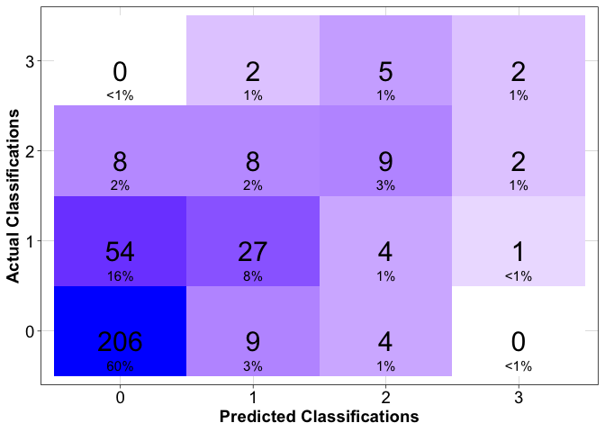

psptools
================

Tools for making shellfish toxicity forecasts using past toxicity
measurements and associated environmental observation data

# Requirements

### [Tensorflow](https://tensorflow.rstudio.com/) and [Keras](https://tensorflow.rstudio.com/guides/keras/basics)

To run this package, you will need Tensorflow, Keras and all of their
dependencies installed and configured on your machine.

For first time Keras users, follow these steps to setup your machine for
running the psptools software:

    install.packages("keras")
    library(reticulate)
    virtualenv_create("r-reticulate", python=install_python())

    library(keras)
    install_keras(envname = "r-reticulate")

### Packages from CRAN

- [rlang](https://CRAN.R-project.org/package=rlang)

- [dplyr](https://CRAN.R-project.org/package=dplyr)

- [yaml](https://CRAN.R-project.org/package=yaml)

- [abind](https://CRAN.R-project.org/package=abind)

- [keras](https://keras.rstudio.com/index.html)

- [ggplot2](https://CRAN.R-project.org/package=ggplot2)

- [stats](https://CRAN.R-project.org/package=stats)

### Installation

    remotes::install_github("BigelowLab/psptools")

# Usage

Here we provide a brief demonstration of going from raw input data to a
forecast of shellfish toxicity measurements. For full documentation of
each step, please refer to
[psptools-guide](https://bigelowlab.github.io/psptools-guide/).

### Input data

Prepare your input data for transforming into model input. The input
table must have the columns:

- The date each toxicity measurement was taken (date)

- A unique location identifier where the sample was taken (location_id)

- The total measured toxicity which will be used to predict
  (total_toxicity)

- Individual columns used for model input (12 congners - gtx4, gtx1,
  etc…)

``` r
library(pspdata)

input_data <- read_psp_data(model_ready=TRUE)

input_data
```

    ## # A tibble: 11,668 × 19
    ##    id    location_id total_toxicity  gtx4  gtx1 dcgtx3  gtx5 dcgtx2   gtx3  gtx2
    ##    <chr> <chr>                <dbl> <dbl> <dbl>  <dbl> <dbl>  <dbl>  <dbl> <dbl>
    ##  1 DMC_… DMC                138.     18.7  37.8      0     0      0 24.6    20.6
    ##  2 Isle… Isleboro             0       0     0        0     0      0  0       0  
    ##  3 MIDG… MIDGIx              15.0     0     0        0     0      0  8.53    0  
    ##  4 PE3M… PE3M                 0       0     0        0     0      0  0       0  
    ##  5 PEN … PEN BB               0       0     0        0     0      0  0       0  
    ##  6 PEN … PEN FIX              0       0     0        0     0      0  0       0  
    ##  7 PENB… PENBB                0.388   0     0        0     0      0  0.388   0  
    ##  8 PENB… PENBB                0       0     0        0     0      0  0       0  
    ##  9 PENF… PENFIX               0.646   0     0        0     0      0  0.646   0  
    ## 10 PENF… PENFIX               0.184   0     0        0     0      0  0.184   0  
    ## # ℹ 11,658 more rows
    ## # ℹ 9 more variables: neo <dbl>, dcstx <dbl>, stx <dbl>, c1 <dbl>, c2 <dbl>,
    ## #   date <date>, classification <dbl>, year <chr>, gap_days <dbl>

### Configuration

Read in a configuration that defines the input data shape, model
architecture and details of the test. In this example, we’ll run a test
using samples made up of 2 measurements that are between 4-10 days apart
to predict one measurement ahead. Total toxicity will be binned into
four classes using the breaks 10, 30 and 80 (psp units), and twelve
saxitoxin congeners will be used from each measurement. The model will
train on data from 2014-2023 and test on 2024.

``` r
library(psptools)
```

    ## 
    ## Attaching package: 'psptools'

    ## The following object is masked from 'package:pspdata':
    ## 
    ##     compute_gap

``` r
cfg <- read_config(filename="test_2024.yaml")

cfg
```

    ## $configuration
    ## [1] "v0.3.1"
    ## 
    ## $image_list
    ## $image_list$tox_levels
    ## [1]  0 10 30 80
    ## 
    ## $image_list$forecast_steps
    ## [1] 1
    ## 
    ## $image_list$n_steps
    ## [1] 2
    ## 
    ## $image_list$minimum_gap
    ## [1] 4
    ## 
    ## $image_list$maximum_gap
    ## [1] 10
    ## 
    ## $image_list$multisample_weeks
    ## [1] "last"
    ## 
    ## $image_list$toxins
    ##  [1] "gtx4"   "gtx1"   "dcgtx3" "gtx5"   "dcgtx2" "gtx3"   "gtx2"   "neo"   
    ##  [9] "dcstx"  "stx"    "c1"     "c2"    
    ## 
    ## 
    ## $model
    ## $model$balance_val_set
    ## [1] FALSE
    ## 
    ## $model$downsample
    ## [1] FALSE
    ## 
    ## $model$use_class_weights
    ## [1] FALSE
    ## 
    ## $model$dropout1
    ## [1] 0.3
    ## 
    ## $model$dropout2
    ## [1] 0.3
    ## 
    ## $model$batch_size
    ## [1] 32
    ## 
    ## $model$units1
    ## [1] 32
    ## 
    ## $model$units2
    ## [1] 32
    ## 
    ## $model$epochs
    ## [1] 128
    ## 
    ## $model$validation_split
    ## [1] 0.2
    ## 
    ## $model$shuffle
    ## [1] TRUE
    ## 
    ## $model$num_classes
    ## [1] 4
    ## 
    ## $model$optimizer
    ## [1] "adam"
    ## 
    ## $model$loss_function
    ## [1] "categorical_crossentropy"
    ## 
    ## $model$model_metrics
    ## [1] "categorical_accuracy"
    ## 
    ## 
    ## $train_test
    ## $train_test$split_by
    ## [1] "year"
    ## 
    ## $train_test$train
    ##  [1] "2014" "2015" "2016" "2017" "2018" "2019" "2020" "2021" "2022" "2023"
    ## 
    ## $train_test$test
    ## [1] "2024"

### Model input

Go from raw input data to seperate traning and testing sets containing
samples made up of consecutive toxicity measurements and their resulting
toxicity n steps ahead

``` r
model_input <- transform_data(cfg, input_data, forecast_mode=FALSE)

str(model_input)
```

    ## List of 2
    ##  $ train:List of 7
    ##   ..$ labels         : num [1:7421, 1:4] 1 1 1 0 0 1 1 1 1 0 ...
    ##   ..$ image          : num [1:7421, 1:24] 0 0 0 0 0 0 0 0 0 0 ...
    ##   ..$ classifications: num [1:7421] 0 0 0 3 2 0 0 0 0 3 ...
    ##   ..$ toxicity       : num [1:7421] 0.579 0 0 83.957 45.657 ...
    ##   ..$ locations      : chr [1:7421] "PSP15.25" "PSP10.07" "PSP27.37" "PSP16.321" ...
    ##   ..$ dates          : num [1:7421] 19116 16666 16664 17309 17294 ...
    ##   ..$ scaling_factors: NULL
    ##  $ test :List of 7
    ##   ..$ labels         : num [1:341, 1:4] 1 1 1 1 1 1 1 0 1 1 ...
    ##   ..$ image          : num [1:341, 1:24] 0 0 0 0 0 0 0 0 0 0 ...
    ##   ..$ classifications: num [1:341] 0 0 0 0 0 0 0 1 0 0 ...
    ##   ..$ toxicity       : num [1:341] 6.502 3.345 0.608 0.169 4.086 ...
    ##   ..$ locations      : chr [1:341] "PSP26.07" "PSP15.25" "PSP12.28" "PSP27.05" ...
    ##   ..$ dates          : num [1:341] 19906 19858 19934 19871 19898 ...
    ##   ..$ scaling_factors: NULL

### Model training and prediction

``` r
model <- forecast_model(cfg, model_input, forecast_mode=FALSE)
```

### Make a forecast list

Combine all of the predictions the model made into a table with their
metadata

``` r
forecast_list <- make_forecast_list(cfg, model$forecast, forecast_mode = FALSE)
  
forecast_list
```

    ## # A tibble: 341 × 13
    ## # Rowwise: 
    ##    version location date       class_bins forecast_start_date forecast_end_date
    ##    <chr>   <chr>    <date>     <chr>      <date>              <date>           
    ##  1 v0.3.1  PSP26.07 2024-07-02 0,10,30,80 2024-07-06          2024-07-12       
    ##  2 v0.3.1  PSP15.25 2024-05-15 0,10,30,80 2024-05-19          2024-05-25       
    ##  3 v0.3.1  PSP12.28 2024-07-30 0,10,30,80 2024-08-03          2024-08-09       
    ##  4 v0.3.1  PSP27.05 2024-05-28 0,10,30,80 2024-06-01          2024-06-07       
    ##  5 v0.3.1  PSP10.29 2024-06-24 0,10,30,80 2024-06-28          2024-07-04       
    ##  6 v0.3.1  PSP11.1  2024-07-01 0,10,30,80 2024-07-05          2024-07-11       
    ##  7 v0.3.1  PSP21.09 2024-08-07 0,10,30,80 2024-08-11          2024-08-17       
    ##  8 v0.3.1  PSP10.33 2024-07-23 0,10,30,80 2024-07-27          2024-08-02       
    ##  9 v0.3.1  PSP25.06 2024-06-25 0,10,30,80 2024-06-29          2024-07-05       
    ## 10 v0.3.1  PSP15.2  2024-07-02 0,10,30,80 2024-07-06          2024-07-12       
    ## # ℹ 331 more rows
    ## # ℹ 7 more variables: actual_class <dbl>, actual_toxicity <dbl>, prob_0 <dbl>,
    ## #   prob_1 <dbl>, prob_2 <dbl>, prob_3 <dbl>, predicted_class <dbl>

### Model skill

``` r
metrics = forecast_metrics(forecast_list)

metrics
```

    ## # A tibble: 1 × 10
    ##      tp    fp    tn    fn accuracy cl_accuracy   f_1 precision sensitivity
    ##   <int> <int> <int> <int>    <dbl>       <dbl> <dbl>     <dbl>       <dbl>
    ## 1     4     5   327     5    0.701       0.971 0.444     0.444       0.444
    ## # ℹ 1 more variable: specificity <dbl>

A confusion matrix can help to visualize multiclass acurracy

``` r
make_confusion_matrix(cfg, forecast_list)
```

<!-- -->
