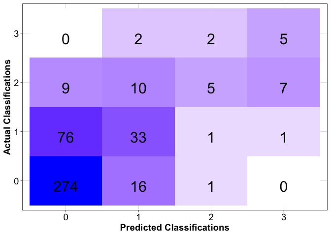

psptools
================

Open-source R package developed for making shellfish toxicity forecasts
using regulatory monitoring data

# Setup

### [Tensorflow](https://tensorflow.rstudio.com/) and [Keras](https://tensorflow.rstudio.com/guides/keras/basics)

To run this package, you will need Tensorflow, Keras and all of their
dependencies installed and configured on your machine.

For first time Keras users, follow these steps to setup your machine for
running the psptools software:

    install.packages("keras")
    library(reticulate)
    virtualenv_create("r-reticulate", python=install_python())

    library(keras)
    install_keras(envname = "r-reticulate")

### Package Installation

    remotes::install_github("BigelowLab/psptools")

# Usage

Here we provide a brief demonstration of going from raw input data to a
forecast of shellfish toxicity measurements. For full documentation of
each step, please refer to
[psptools-guide](https://bigelowlab.github.io/psptools-guide/).

### Input data

Prepare your input data for transforming into model input. The input
table must have the columns:

- The date and year each toxicity measurement was taken (`date` +
  `year`)

- A unique location identifier where the sample was taken
  (`location_id`)

- The total measured toxicity which will be used to predict
  (`total_toxicity`)

- The species (or genus) of shellfish measured (`species`)

- The region the sample is from, although the region may be the same for
  both train and test sets (`region`)

- Individual columns used for model input ie 12 congeners (`gtx4`,
  `gtx1`, etc…)

``` r
input_data <- read_psp_data(model_ready = TRUE)

glimpse(input_data)
```

    ## Rows: 15,200
    ## Columns: 20
    ## $ id             <chr> "12091_2019-07-10_arctica", "12092_2019-07-10_arctica",…
    ## $ location_id    <chr> "12091", "12092", "12125", "ACINC", "ACINC", "ACInc", "…
    ## $ species        <chr> "arctica", "arctica", "arctica", "arctica", "arctica", …
    ## $ total_toxicity <dbl> 31.4491000, 44.8684900, 70.3315700, 0.3268534, 5.949918…
    ## $ gtx4           <dbl> 0.000000, 8.088602, 17.028635, 0.000000, 0.000000, 0.00…
    ## $ gtx1           <dbl> 4.831219, 6.642926, 12.681950, 0.000000, 0.000000, 0.00…
    ## $ dcgtx3         <dbl> 0, 0, 0, 0, 0, 0, 0, 0, 0, 0, 0, 0, 0, 0, 0, 0, 0, 0, 0…
    ## $ gtx5           <dbl> 0, 0, 0, 0, 0, 0, 0, 0, 0, 0, 0, 0, 0, 0, 0, 0, 0, 0, 0…
    ## $ dcgtx2         <dbl> 0, 0, 0, 0, 0, 0, 0, 0, 0, 0, 0, 0, 0, 0, 0, 0, 0, 0, 0…
    ## $ gtx3           <dbl> 18.3904384, 22.9927635, 28.5759119, 0.3268534, 4.390941…
    ## $ gtx2           <dbl> 4.982137, 7.144196, 8.679571, 0.000000, 0.000000, 0.000…
    ## $ neo            <dbl> 0, 0, 0, 0, 0, 0, 0, 0, 0, 0, 0, 0, 0, 0, 0, 0, 0, 0, 0…
    ## $ dcstx          <dbl> 0, 0, 0, 0, 0, 0, 0, 0, 0, 0, 0, 0, 0, 0, 0, 0, 0, 0, 0…
    ## $ stx            <dbl> 3.245307, 0.000000, 3.365504, 0.000000, 0.000000, 0.000…
    ## $ c1             <dbl> 0, 0, 0, 0, 0, 0, 0, 0, 0, 0, 0, 0, 0, 0, 0, 0, 0, 0, 0…
    ## $ c2             <dbl> 0.000000, 0.000000, 0.000000, 0.000000, 1.558977, 0.000…
    ## $ date           <date> 2019-07-10, 2019-07-10, 2019-07-10, 2018-04-27, 2019-0…
    ## $ year           <chr> "2019", "2019", "2019", "2018", "2019", "2019", "2019",…
    ## $ region         <chr> "maine", "maine", "maine", "maine", "maine", "maine", "…
    ## $ gap_days       <dbl> 0, 0, 0, 0, 0, 0, 2, 62, 0, 0, 14, 18, 0, 0, 11, 15, 17…

### Model Configuration Testing

``` r
cfg <- list(
  configuration="irish_2week",
  image_list = list(tox_levels = c(0,10,30,80),
                    forecast_steps = 1,
                    n_steps = 2,
                    minimum_gap = 4,
                    maximum_gap = 10,
                    multisample_weeks = "last",
                    toxins = c("gtx1", "gtx4", "gtx2", "gtx3", "dcgtx2", "dcgtx3", "gtx5", "neo", "dcstx", "stx", "c1", "c2")),
  model = list(balance_val_set=FALSE,
               downsample=FALSE,
               use_class_weights=FALSE,
               dropout1 = 0.3,
               dropout2 = 0.3,
               batch_size = 32, 
               units1 = 32, 
               units2 = 32, 
               epochs = 64, 
               validation_split = 0.2,
               shuffle = TRUE,
               num_classes = 4,
               optimizer="adam",
               loss_function="categorical_crossentropy",
               model_metrics=c("categorical_accuracy")),
  train_test = list(split_by = "year_region_species",
                    train = list(species = "mytilus",
                                 region = "maine",
                                 year=c("2014", "2015", "2016", "2017", "2018", "2019", "2020", "2021", "2022", "2023")), 
                    test = list(species = "mytilus",
                                region = "maine",
                                year = c("2024")))
)
```

Use `run_ensemble_test()` to test the performance of a model
configuration

The output includes the metrics of predictions from an ensemble of
`n_runs`,

``` r
test$ensemble_metrics
```

    ## # A tibble: 1 × 10
    ##      tp    fp    tn    fn accuracy cl_accuracy   f_1 precision sensitivity
    ##   <int> <int> <int> <int>    <dbl>       <dbl> <dbl>     <dbl>       <dbl>
    ## 1     5     8   425     4    0.717       0.973 0.455     0.385       0.556
    ## # ℹ 1 more variable: specificity <dbl>

and an ensemble confusion matrix

``` r
test$ensemble_cm
```

<!-- -->

### Forecasting

To make real-time predictions, assign `split_by = "forecast_mode"` in
the configuration object, then run:

    forecast <- run_ensemble_forecast(cfg, input_data, ...)

# Requirements from CRAN

- [rlang](https://CRAN.R-project.org/package=rlang)

- [dplyr](https://CRAN.R-project.org/package=dplyr)

- [yaml](https://CRAN.R-project.org/package=yaml)

- [abind](https://CRAN.R-project.org/package=abind)

- [keras](https://keras.rstudio.com/index.html)

- [ggplot2](https://CRAN.R-project.org/package=ggplot2)

- [stats](https://CRAN.R-project.org/package=stats)

- [readr](https://CRAN.R-project.org/package=readr)
